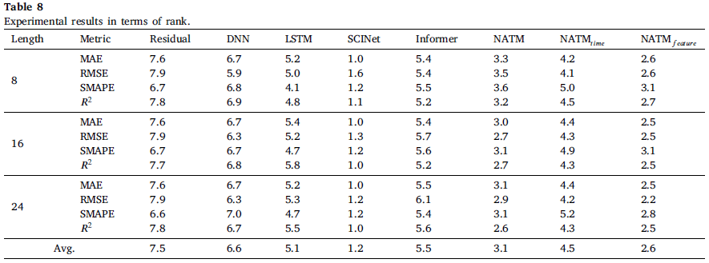

# Neural additive time-series models: Explainable deep learning for multivariate time-series prediction (NATMs)


This repo is the Pytorch implementation of [NATMs](https://doi.org/10.1016/j.eswa.2023.120307).

## How to use?

We provide the jupyter notebook file (.ipynb) for learning and inference process.</br>
Also, python script registered but we recommend to use the notebook.</br>


## Performance




## Citation

```
@article{JO2023120307,
title = {Neural additive time-series models: Explainable deep learning for multivariate time-series prediction},
journal = {Expert Systems with Applications},
volume = {228},
pages = {120307},
year = {2023},
issn = {0957-4174},
doi = {https://doi.org/10.1016/j.eswa.2023.120307},
author = {Wonkeun Jo and Dongil Kim},
keywords = {Deep learning, Explainable artificial intelligence,Multivariate time series prediction, Neural additive models, Parameter sharing},
}
```
